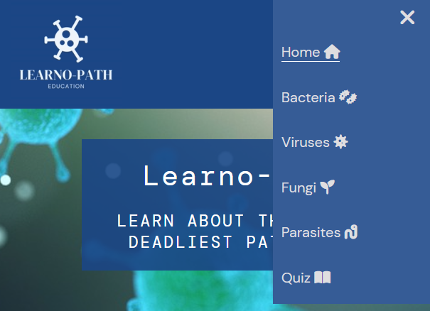
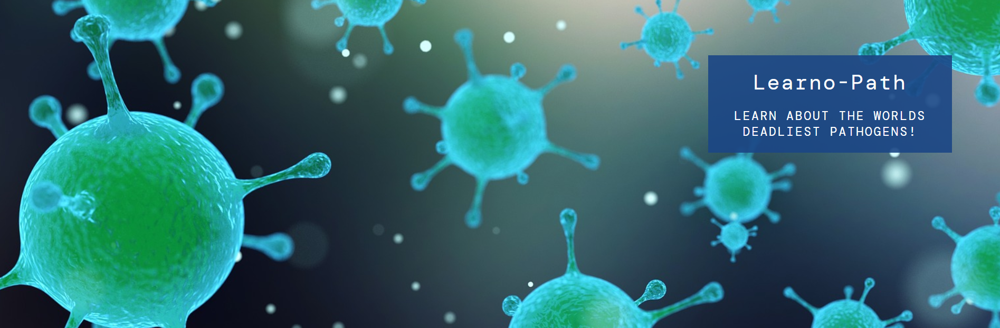
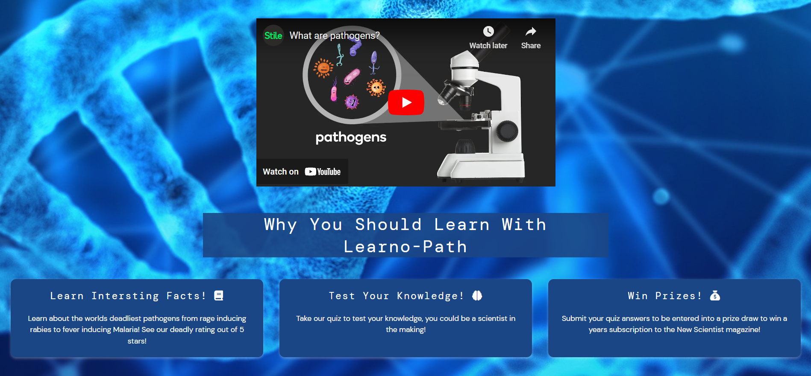
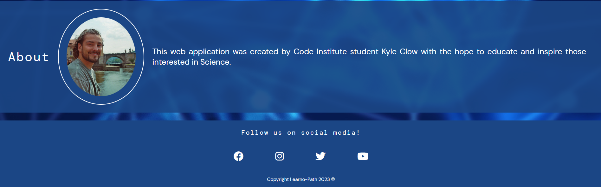
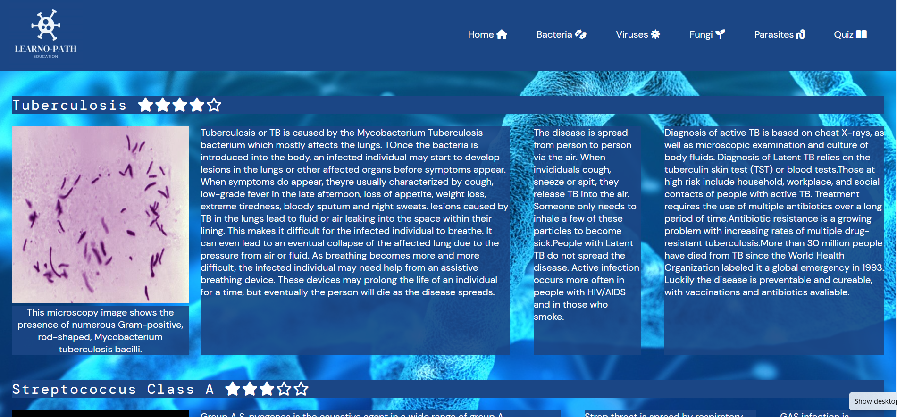

# Learno-Path

Learno-Path is a scientific website focused on educating individuals who want to learn more about the worlds deadliest pathogens. Learno-Path provides a range of learning material to allow users of all ages an abilities to delve into the world of pathology.

## Contents

1. [User Experience](#user-experience)
   * [User Stories](#user-stories)
2. [Design](#design)
   * [Colour Scheme](#colour-scheme)
   * [Typography](#typography)
   * [Imagery](#imagery)
   * [Wireframes](#wireframes)
3. [Features](#features)
   * [Future Implementations](#future-implementations)
   * [Accesibility](#accesibility)
4. [Technologies](#technologies)
   * [Languages](#languages)
   * [Frameworks, Libraries and Programs](#frameworks-libraries-and-programs)
5. [Testing](#testing)
6. [Deployment](#deployment)
7. [Credits](#credits)
   * [Code](#code)
   * [Content](#c)

## User Expeirence
* 

### User Stories

* As a user of Learno-Path I want to be able to navigate the site quickly and easily.
   * End user goal: Provide a navigation bar, well designed content structure and responsive elements.
   * Acceptance criteria: Allow the user to easily navigate from page to page to access and learn content. 

* As a user I want to learn through the use of different content such as images, video and text.
   * End user goal: Use a range of learning materials in the site.
   * Acceptance criteria: Use YouTube videos, images of different pathogens and their lifecycles as well as accompanying text and captions for 
     figures.

* As a user I want to be able to test my knowledge.
   * End user goal: Provide a form element so users can submit their answers. This makes sure users go back and read through content fully.
     Also motivate users through entry into a prize draw.
   * Acceptance criteria: Design a quiz with a range of questions to test a breadth of knowledge on information provided on the website. Allow 
     users to submit their answers.
     
* As a user I 

## Design

### Colour Scheme
* I used a simple color scheme of shades of blue and white to make it look clean and professional, allowing users to read the content easily.
 
 

|Colour        |                |            |           | 
| :-------     |    :--------:  |   -------: |  -------: | 
| #1b4685      | #fafafa        | #dfdee0    | #365c96   | 

### Typrography

I used [Fontjoy](https://fontjoy.com/) to experiment with font parings. I decided on  DM Mono for headings and DM sans for paragraph elements. I utilized Google fonts to use them in my project. 

### Imagery

### Wireframes

Desktop Wireframes

[Home page](./wireframes/desktop/Home%20page.png)
 
[Content pages](./wireframes/desktop/Content%20pages.png)
 
[Quiz page](./wireframes/desktop/Quiz%20page.png)

Mobile Wireframes

[Home page](./wireframes/mobile/Home%20page%20mobile%20wireframe.png)
 
[Content pages](./wireframes/mobile/Content%20pages%20mobile%20wireframe.png)
 
[Quiz page](./wireframes/mobile/Quiz%20page%20mobile%20wireframe.png)

## Features

* Navigation Bar 
   * Featured on all five pages, the fully responsive navigation bar includes links to the Home page, content pages and quiz page. It is identical across all pages to allow for standardized style and easy navigation.
   * This section will allow the user to easily navigate from page to page across all devices without having to revert back to the previous page via the ‘back’ button.
   * At smaller screen sizes the navigation bar transforms into a JavaScript hamburger menu, allowing the site to be visually pleasing at these sizes. 

* The landing page image
   * The landing includes a photograph with text overlay introducing the website and its theme. The image changes to a bacteria illustration when hovering with the mouse and back again when the cursor is taken off the image, providing an interesting an eyecatching feature. 
  

* The pathogens video and why you should learn with us section.
   * This section gives a general background introduction into pathogens in an easy to understand video format.
   * Why you should learn with Learno-Path is displayed across three eye catching cards, showing the user the benefits of using the site. 

* The about section and footer
   * The about section includes an image of myself and the reason for creating the site.
   * The footer section includes links to social media sites for Learno-Path which open in a new tab.

* Content pages
   * The content pages include images, video and text alongside fig captions to help explain media elements. 
   * This section is valuable as it provides information on different pathogens to the user. 

   

### Future Implementations

   * For future applications of the website I would like to include links to scientific papers so that the user can learn more in depth knowledge about the subject matter.
   * Add a feedback feature after completing the quiz so users can check their answers.
   * Make quiz questions randomly generate from a pool, so a wider range of knoweldge can be tested.
   * Increase the range of material covered in the site.
   * Link the quiz to a database to capture and store user data.

### Accesibility

## Technologies

### Languages

* HTML: HTML was used to create the basic architecture of the Learno-Path website.

* CSS: I used CSS to style the HTML elements, making them more eye catching to improve the user experience.

* JavaScript: I used JavaScript to create a hamburger menu to allow my navigation element to be responsive at smaller screen sizes.

### Frameworks, Libraries and Programs

* Font Awesome: Font Awesome was used to select icons.
* Am I Responsive: Am I Responsive? was used to test website responsiveness.
* Google Fonts: Google Fonts was used to select the fonts.
* Canva: Canva was used to make the website logo. 
* Favicon: Favicon was used to pick a virus shaped favicon. 
* Balsamiq: Balsamiq was used to create the wireframes for the website. 
* Pexels: Pexels was used for copyright free images.
* Upsplash: Upsplash was used for copyright free images.
* Fontjoy: Fontjoy was used to provide font paring ideas. 
* CloudConvert: I used CloudConvert to change my images into webp format.

## Testing

## Deployment

* I deployed the site to GitHub pages. The steps to deploy the site are as follows:
   * In the GitHub repository, navigate to the Settings tab
   * From the source section drop-down menu, select the Master Branch
   * Once the master branch has been selected, the page will be automatically refreshed with a detailed ribbon display to indicate the successful deployment.

[Link to live site](https://ktc96.github.io/project-one/)

## Credits

### Code
* My coursemate Mia Rasmussen showed me how to create a JavaScript hamburger style navigation menu so my site would be responsive at smaller screen sizes.
* Creation of my nav bar as well as the general structure of the website was taken from the Love Running walkthrough tutorial.
* I watched many tutorials on flexbox to help me make my website responsive and better position elements on my site.

### Content

* The text information for each pathogen page was taken from their respective Wikipedia pages. I edited and simplified the text to make it more clear and allow it to be displayed correctly on the site. 
* The terms and conditions of the quiz page were taken from the Love Running project and adapted for my own use. 

### Media

* The images on the home page were taken from [Pixabay](https://pixabay.com/).
* The images on content page were taken from [Pexels](https://www.pexels.com/). 
* Through Pexels I also found more suitable images using [CDC](https://www.cdc.gov/)
* The image of T.Brucei on the parasites page was taken by myself during unviversity study.

### Acknowldegements 

I would like to thank two of my course collegues Mia Rasmussen and Hope Tracy for their help in understanding coding concepts. I would also like to thank my mentor Jack for checking my code and supporting me through this project. 