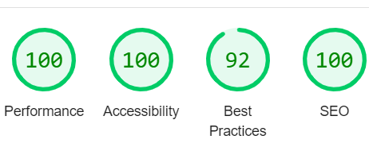
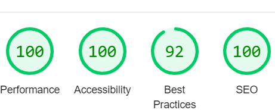
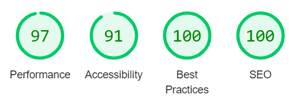

* I pubished my site via GitHub pages and shared with coursemates to recieve feedback. 
* During testing, I used four different browsers to ensure cross-compatibility: Chrome, Firefox,Opera and Edge.
*I used google devtools to simulate different screen sizes/devices from 320 px up to 4000px in width.

Navbar: All the links on the navbar are working on desktop and mobile screens. 

I clicked on the logo and it took me to the index.html page
I clicked on the Home and it took me to the index.html page
I clicked on each content page and it took me to the correct page
I clicked on the quiz page and it took me to the quiz.html page

Footer: All the links on the footer are working.

Each link took me to the correct social media website

Quiz page:

When I fill out the quiz and click submit, I am taken to a sumbission page thanking the user for entering the draw. They can then nagivate back to any other page using the nav bar. 

Aim: Have my nav bar evenly spaced and responsive across all screen sizes. 

Issue:
Using float was difficult and hampered the responsiveness of my site.

Solution:
I learnt and used CSS flexbox for my site. 

Issue: At smaller screen sizes, the nav bar split onto two lines which was not aesthetically pleasing.

Solution: I used a media query to reduce the text size and margins of the nav bar, however this still was not suitable for small screen sizes. As outlined in the acknowldegemnts section, a coursemate demonstrated how I could create a JavaScript Hamburger menu, allowing my site to be responsive at small screen sizes. 

Aim: The site to load quickly when analysed by lighthouse in dev tools

Issue: The performance across the site was lower than I wanted.

Solution: I converted all png files into webp files to decrease loading time.

Issue: Embedded YouTube videos were increasing loading time for the page. 

Solution: I attempted to set up a lazy loading facade but I was not able to figure this out.

Aim: Make a quiz page that sends data via method="POST"

Issue: To do this I had to set up my own database, which I looked into but was too complex.

Solution: I linked the submit button for the quiz to a submission page, where the user is thanked for submitting their data. 

Aim: To make all pages of my site responsive

Issue: On my quiz page the quiz section was going off screen at smaller screen sizes

Solution: I removed the overflow property and set up a media query to decrease font size at smaller screen sizes. 

Contrast:

I checked the contrast of the text elements of my site, using [WebAIM Contrast Checker](https://webaim.org/resources/contrastchecker/) to ensure my site met WCA guidelines.

* [Contrast](./testing/contrast.png)

Post Development Testing

Validators

HTML [https://validator.w3.org/nu/](https://validator.w3.org/nu/)

CSS [https://jigsaw.w3.org/css-validator/](https://jigsaw.w3.org/css-validator/)

Lighthouse Scores:

* I performed lighthouse tests in incognito mode to prevent interference from extensions.
* I ran the tests for mobile and desktop.

Desktop:

Home page: 

Bacteria page:

Virus page: 

Fungi page: 

Parasite page: 

Quiz page: 

Submission page: 

